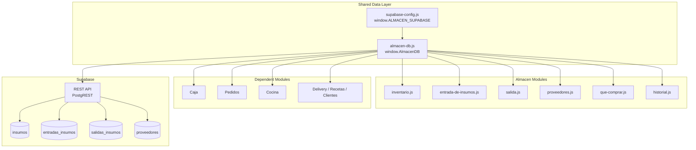

# Design Document: almacen-supabase

## Overview

Migración del módulo Almacén de MiRest de localStorage a Supabase como fuente de verdad central. La arquitectura actual usa `localStorage` como única capa de persistencia, lo que impide sincronización entre dispositivos y acceso compartido desde otros módulos del sistema.

La solución introduce una capa de datos compartida (`Almacen/almacen-db.js`) que encapsula todas las llamadas a la Supabase REST API usando `fetch` directo, sin SDK. Todos los submódulos del Almacén cargarán este archivo antes de su propio JS. Los módulos dependientes (Caja, Pedidos, Cocina, etc.) acceden al inventario a través de `window.getInventarioSupabase()`.

**Restricciones técnicas clave:**
- Vanilla HTML/CSS/JS, sin bundler ni módulos ES
- Sin SDK de Supabase — solo `fetch` a la REST API
- Supabase URL: `https://twneirdsvyxsdsneidhi.supabase.co`
- La anon key se expone en `Almacen/supabase-config.js` como `window.ALMACEN_SUPABASE`

---

## Architecture



**Flujo de carga de scripts en cada HTML del Almacén:**
```html
<script src="../supabase-config.js"></script>
<script src="../almacen-db.js"></script>
<script src="./modulo.js"></script>
```

---

## Components and Interfaces

### `Almacen/supabase-config.js`

Expone la configuración de conexión como variable global:

```javascript
window.ALMACEN_SUPABASE = {
  url: "https://twneirdsvyxsdsneidhi.supabase.co",
  anonKey: "<anon-key-aqui>"
};
```

### `Almacen/almacen-db.js` — Capa de datos compartida

Expone `window.AlmacenDB` con los siguientes métodos públicos:

```javascript
window.AlmacenDB = {
  // --- Insumos ---
  getInsumos(),                          // GET /insumos → Promise<Insumo[]>
  getInsumoByCodigo(codigo),             // GET /insumos?codigo=eq.X → Promise<Insumo>
  updateStockInsumo(codigo, nuevoStock), // PATCH /insumos?codigo=eq.X → Promise<void>

  // --- Entradas ---
  getEntradas(),                         // GET /entradas_insumos?order=created_at.desc → Promise<Entrada[]>
  insertEntrada(entrada),                // POST /entradas_insumos → Promise<void>

  // --- Salidas ---
  getSalidas(),                          // GET /salidas_insumos?order=created_at.desc → Promise<Salida[]>
  insertSalida(salida),                  // POST /salidas_insumos → Promise<void>

  // --- Proveedores ---
  getProveedores(),                      // GET /proveedores → Promise<Proveedor[]>
  insertProveedor(proveedor),            // POST /proveedores → Promise<void>
  updateProveedor(id, datos),            // PATCH /proveedores?id=eq.X → Promise<void>

  // --- Compatibilidad con módulos dependientes ---
  getInventarioSupabase(),               // Alias de getInsumos() con mapeo a estructura legacy
};

// Función global para módulos dependientes
window.getInventarioSupabase = () => window.AlmacenDB.getInventarioSupabase();
```

**Función interna `_fetch(endpoint, options)`:**

Wrapper sobre `fetch` que:
1. Construye la URL completa: `window.ALMACEN_SUPABASE.url + '/rest/v1/' + endpoint`
2. Inyecta los headers requeridos en todas las peticiones:
   ```
   apikey: <anonKey>
   Authorization: Bearer <anonKey>
   Content-Type: application/json
   Prefer: return=minimal  (para POST/PATCH)
   ```
3. Verifica `response.ok`; si no, lanza un error con código y mensaje
4. Registra errores en `console.error` con endpoint, código HTTP y mensaje

**Función `_mostrarError(mensaje)`:**

Muestra una notificación de error visible al usuario. Crea un elemento `div` con clase `almacen-error-toast` y lo inserta en el DOM con auto-dismiss de 5 segundos.

**Mapeo de campos (Supabase → legacy):**

La Supabase REST API retorna campos en `snake_case`. `getInventarioSupabase()` mapea a la estructura que usaba localStorage:

| Supabase (snake_case) | Legacy (camelCase) |
|---|---|
| `stock_actual` | `stockActual` |
| `stock_minimo` | `stockMinimo` |
| `costo_unitario` | `costoUnitario` |
| `ultimo_ingreso` | `ultimoIngreso` |
| `costo_total_movimiento` | `costoTotalMovimiento` |
| `referencia_id` | `referenciaId` |

### Módulos del Almacén (cambios por módulo)

Cada módulo reemplaza sus llamadas a `localStorage` por llamadas a `window.AlmacenDB`:

| Módulo | localStorage eliminado | Reemplazado por |
|---|---|---|
| inventario.js | `inventario_mirest` | `AlmacenDB.getInsumos()` |
| entrada-de-insumos.js | `inventario_mirest_historial` | `AlmacenDB.getEntradas()`, `AlmacenDB.insertEntrada()` |
| salida.js | `inventario_mirest_salidas` | `AlmacenDB.getSalidas()`, `AlmacenDB.insertSalida()` |
| proveedores.js | `inventario_mirest_proveedores` | `AlmacenDB.getProveedores()`, etc. |
| que-comprar.js | `inventario_mirest` | `AlmacenDB.getInsumos()` |
| historial.js | todos los anteriores | `AlmacenDB.*` según módulo seleccionado |

---

## Data Models

### Tabla `insumos`

```sql
CREATE TABLE insumos (
  id            uuid PRIMARY KEY DEFAULT gen_random_uuid(),
  codigo        text UNIQUE NOT NULL,
  nombre        text NOT NULL,
  categoria     text,
  ubicacion     text,
  stock_actual  numeric DEFAULT 0,
  unidad        text,
  stock_minimo  numeric DEFAULT 0,
  costo_unitario numeric DEFAULT 0,
  ultimo_ingreso text,
  proveedor     text,
  created_at    timestamptz DEFAULT now(),
  updated_at    timestamptz DEFAULT now()
);
```

### Tabla `entradas_insumos`

```sql
CREATE TABLE entradas_insumos (
  id                    text PRIMARY KEY,
  fecha                 text,
  hora                  text,
  comprobante           text,
  usuario               text,
  notas                 text,
  tipo                  text,
  referencia_id         text,
  costo_total_movimiento numeric DEFAULT 0,
  ingredientes          jsonb,
  archivos              jsonb,
  created_at            timestamptz DEFAULT now()
);
```

### Tabla `salidas_insumos`

```sql
CREATE TABLE salidas_insumos (
  id                    text PRIMARY KEY,
  fecha                 text,
  hora                  text,
  motivo                text,
  justificacion         text,
  comprobante           text,
  usuario               text,
  notas                 text,
  tipo                  text,
  referencia_id         text,
  costo_total_movimiento numeric DEFAULT 0,
  ingredientes          jsonb,
  archivos              jsonb,
  created_at            timestamptz DEFAULT now()
);
```

### Tabla `proveedores`

```sql
CREATE TABLE proveedores (
  id            bigint PRIMARY KEY,
  nombre        text NOT NULL,
  ruc           text,
  telefono      text,
  categoria     jsonb,
  ubicacion     text,
  dias_credito  integer DEFAULT 0,
  ultimo_ingreso text,
  estado        text DEFAULT 'Activo',
  distancia_km  numeric DEFAULT 0,
  created_at    timestamptz DEFAULT now(),
  updated_at    timestamptz DEFAULT now()
);
```

### Estructura del objeto `Insumo` (en memoria, post-mapeo)

```javascript
{
  id: "uuid",
  codigo: "INS001",
  nombre: "Pescado fresco (corvina)",
  categoria: "Pescados y mariscos",
  ubicacion: "Estante 8",
  stockActual: 26,        // mapeado desde stock_actual
  unidad: "kg",
  stockMinimo: 10,        // mapeado desde stock_minimo
  costoUnitario: 25.00,   // mapeado desde costo_unitario
  ultimoIngreso: "2026-04-03", // mapeado desde ultimo_ingreso
  proveedor: "Distribuidora El Mercado",
  estado: "ok"            // calculado en cliente, no almacenado en BD
}
```

### Cálculo de `Stock_Estado` (lógica cliente)

```javascript
function calcularEstado(stockActual, stockMinimo) {
  if (stockActual === 0 || stockActual <= stockMinimo) return 'critico';
  if (stockActual <= stockMinimo * 2) return 'bajo';
  return 'ok';
}
```

---

## Correctness Properties

*Una propiedad es una característica o comportamiento que debe ser verdadero en todas las ejecuciones válidas del sistema — esencialmente, una declaración formal sobre lo que el sistema debe hacer. Las propiedades sirven como puente entre especificaciones legibles por humanos y garantías de corrección verificables automáticamente.*

### Property 1: Cálculo correcto de Stock_Estado

*Para cualquier* par de valores numéricos `(stockActual, stockMinimo)` con `stockMinimo >= 0`, la función `calcularEstado` debe retornar:
- `'critico'` si `stockActual <= stockMinimo` o `stockActual === 0`
- `'bajo'` si `stockActual > stockMinimo` y `stockActual <= stockMinimo * 2`
- `'ok'` si `stockActual > stockMinimo * 2`

**Validates: Requirements 2.3**

---

### Property 2: Actualización de stock en entradas preserva la suma

*Para cualquier* insumo con `stock_actual = X` y una entrada de `cantidad = Y` (donde `Y > 0`), después de registrar la entrada el `stock_actual` del insumo en Supabase debe ser `X + Y`.

**Validates: Requirements 3.2**

---

### Property 3: Actualización de stock en salidas preserva la resta

*Para cualquier* insumo con `stock_actual = X` y una salida de `cantidad = Y` (donde `0 < Y <= X`), después de registrar la salida el `stock_actual` del insumo en Supabase debe ser `X - Y`.

**Validates: Requirements 4.2**

---

### Property 4: Validación de stock insuficiente en salidas

*Para cualquier* intento de registrar una salida donde la `cantidad` solicitada es mayor al `stock_actual` del insumo, la operación debe ser rechazada y el `stock_actual` no debe modificarse.

**Validates: Requirements 4.4**

---

### Property 5: Filtrado correcto de insumos a comprar

*Para cualquier* lista de insumos retornada por Supabase, el módulo Qué Comprar debe incluir exactamente aquellos insumos cuyo `stock_actual <= stock_minimo`, sin incluir ningún insumo con `stock_actual > stock_minimo`.

**Validates: Requirements 6.1**

---

### Property 6: Cálculo correcto de cantidad sugerida

*Para cualquier* insumo con valores `(stock_actual, stock_minimo)`, la cantidad sugerida de compra debe ser igual a `MAX(0, (stock_minimo × 2) - stock_actual)`.

**Validates: Requirements 6.2**

---

### Property 7: Headers de autenticación en todas las peticiones

*Para cualquier* petición HTTP realizada por `AlmacenDB._fetch()` (GET, POST, PATCH), la petición debe incluir los headers `apikey` y `Authorization: Bearer <anonKey>` con el valor correcto de la configuración.

**Validates: Requirements 9.5**

---

### Property 8: Errores HTTP disparan logging y notificación

*Para cualquier* código de respuesta HTTP en el rango 400–599 retornado por la Supabase REST API, el cliente debe: (a) llamar a `console.error` con el endpoint y el código, y (b) mostrar una notificación de error visible al usuario.

**Validates: Requirements 9.1, 9.2**

---

### Property 9: Mapeo bidireccional de campos snake_case ↔ camelCase

*Para cualquier* objeto insumo retornado por Supabase en formato `snake_case`, la función `getInventarioSupabase()` debe producir un objeto equivalente en `camelCase` donde todos los campos mapeados tienen el mismo valor numérico/textual que el original.

**Validates: Requirements 2.7, 8.1**

---

### Property 10: Sincronización de localStorage después de escrituras

*Para cualquier* operación de escritura exitosa en Supabase (insertar entrada, insertar salida, actualizar stock), el `localStorage` debe actualizarse con los datos más recientes del inventario, de modo que `JSON.parse(localStorage.getItem('inventario_mirest'))` retorne un array con los mismos insumos que Supabase.

**Validates: Requirements 8.3**

---

## Error Handling

### Estrategia general

Todos los errores de red y HTTP se manejan en `AlmacenDB._fetch()`. Los módulos individuales no necesitan manejar errores de red directamente — solo manejan el estado de UI.

```
Petición HTTP
    ↓
_fetch() ejecuta fetch()
    ↓
¿response.ok?
  NO → console.error(endpoint, status, message)
       _mostrarError(mensaje en español)
       throw new Error(...)
  SÍ → return response.json()
```

### Errores por escenario

| Escenario | Comportamiento |
|---|---|
| Config no cargada (`window.ALMACEN_SUPABASE` undefined) | Mostrar error en el contenedor principal y detener `init()` |
| GET falla al cargar página | Mostrar mensaje de error en la tabla, no bloquear la UI |
| POST de entrada/salida falla | Mostrar error, no actualizar stock, no limpiar formulario |
| PATCH de stock falla (después de POST exitoso) | Mostrar advertencia: "Historial guardado pero stock no actualizado" |
| Timeout / red no disponible | Mostrar indicador de carga, reintentar una vez después de 3s |
| Stock insuficiente (validación cliente) | Alert con mensaje descriptivo antes de enviar a Supabase |

### Notificación de error (`_mostrarError`)

```javascript
function _mostrarError(mensaje) {
  const toast = document.createElement('div');
  toast.className = 'almacen-error-toast';
  toast.textContent = mensaje;
  document.body.appendChild(toast);
  setTimeout(() => toast.remove(), 5000);
}
```

El CSS del toast se incluye inline en `almacen-db.js` para no depender de archivos CSS externos.

---

## Testing Strategy

### Evaluación de PBT

Esta feature es adecuada para property-based testing en las funciones de lógica pura del cliente:
- Cálculo de `Stock_Estado`
- Cálculo de cantidad sugerida
- Mapeo de campos snake_case → camelCase
- Validación de stock insuficiente
- Filtrado de insumos a comprar

Las operaciones de integración con Supabase (GET, POST, PATCH) se testean con mocks de `fetch`.

### Librería PBT

**[fast-check](https://github.com/dubzzz/fast-check)** (JavaScript) — ejecutado con Vitest o Jest.

### Tests unitarios (ejemplos concretos)

- Verificar que `window.ALMACEN_SUPABASE` tiene `url` y `anonKey`
- Verificar que `window.AlmacenDB` expone todos los métodos requeridos
- Verificar que `window.getInventarioSupabase` es una función
- Simular ausencia de config y verificar mensaje de error
- Mock de fetch con error 401 → verificar `console.error` y toast
- Mock de fetch con error 500 → verificar que el formulario no se limpia

### Tests de integración

- GET `/insumos` retorna array con los 39 insumos seed
- POST `/entradas_insumos` + PATCH `/insumos` actualizan stock correctamente
- POST `/salidas_insumos` + PATCH `/insumos` decrementan stock correctamente
- GET `/proveedores` retorna los proveedores guardados

### Tests de propiedad (fast-check, mínimo 100 iteraciones)

Cada test referencia su propiedad del diseño con el tag:
`// Feature: almacen-supabase, Property N: <texto>`

```javascript
// Feature: almacen-supabase, Property 1: Cálculo correcto de Stock_Estado
fc.assert(fc.property(
  fc.float({ min: 0, max: 1000 }),
  fc.float({ min: 0, max: 500 }),
  (stockActual, stockMinimo) => {
    const estado = calcularEstado(stockActual, stockMinimo);
    if (stockActual === 0 || stockActual <= stockMinimo) return estado === 'critico';
    if (stockActual <= stockMinimo * 2) return estado === 'bajo';
    return estado === 'ok';
  }
), { numRuns: 100 });

// Feature: almacen-supabase, Property 2: Actualización de stock en entradas
fc.assert(fc.property(
  fc.float({ min: 0, max: 1000 }),
  fc.float({ min: 0.01, max: 500 }),
  async (stockActual, cantidad) => {
    // Mock fetch para PATCH
    const nuevoStock = stockActual + cantidad;
    // Verificar que el PATCH se llama con stock_actual = nuevoStock
    ...
  }
), { numRuns: 100 });

// Feature: almacen-supabase, Property 5: Filtrado correcto de insumos a comprar
fc.assert(fc.property(
  fc.array(fc.record({
    codigo: fc.string(),
    stockActual: fc.float({ min: 0, max: 200 }),
    stockMinimo: fc.float({ min: 1, max: 100 })
  })),
  (insumos) => {
    const resultado = filtrarParaComprar(insumos);
    return resultado.every(i => i.stockActual <= i.stockMinimo) &&
           insumos.filter(i => i.stockActual <= i.stockMinimo).length === resultado.length;
  }
), { numRuns: 100 });
```

### Script de migración SQL

El archivo `Almacen/migration.sql` contiene:
1. `CREATE TABLE` para las 4 tablas
2. `ALTER TABLE ... ENABLE ROW LEVEL SECURITY`
3. `CREATE POLICY` para acceso público con anon key
4. `INSERT INTO insumos` con los 39 insumos del seed
5. Índices en `codigo` (insumos), `created_at` (entradas, salidas)
